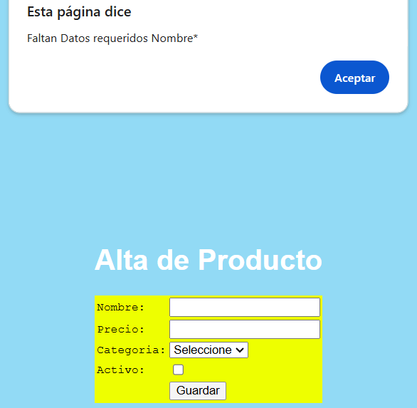
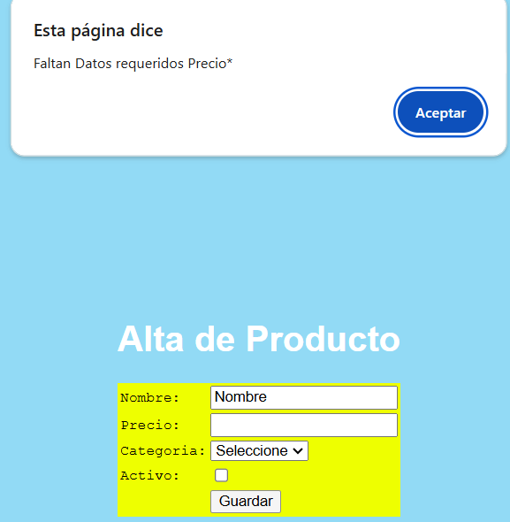
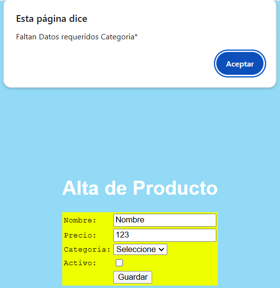
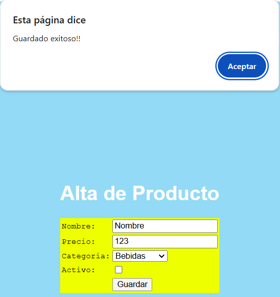
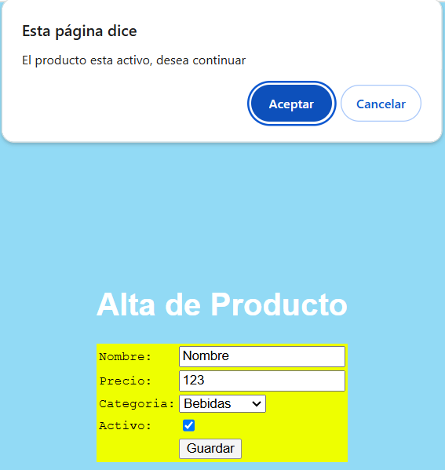

{width="8.518055555555556in"
height="11.023365048118984in"}

EJERCICIO 1 AD-COMUN-JRP

INSTRUCCIONES PARA REALIZAR EJERCICIOS PRACTICOS

Feb-2025

Índice

[1. Descripción 1](#_Toc136614292)

[2. Prerrequisitos 1](#_Toc136614293)

[3. Caso de Estudio 1](#_Toc136614294)

[4. Pasos para entregar los ejercicios 1](#_Toc136614299)

[5. Links de referencia 2](#_Toc136614300)

[6. Anexos 3](#_Toc136614302)

5.  

<!-- -->

5.  Descripción

El presente documento muestra los pasos a seguir para realizar los
ejercicios prácticos que demuestren los conocimientos adquiridos para
los siguientes temas: HTML, CSS, JS, OOP, SQL,

**Importante**: Este ejercicio aplica para desarrolladores Java y Net,
resuelva su ejercicio de programación de acuerdo a su Path de Carrera
(Java o Net).

6.  Prerrequisitos

-   Haber tomado el curso Comun Web SWEng JR PR y completado todos los
    cursos internos que son HTML, CSS, JavaScript, SQL, OOP Best
    Practices

-   Tener instalado Visual Studio Code (última versión)

-   Conocimientos de modelado de clases con herramientas como DrawIO,
    Umbrello, Staruml

-   Tener instalado SQL Server Express (o Developer) de formal local
    (versión 16 (2022) en adelante) así como el SQL Management Studio
    compatible con esa versión o MariaDB v11 o superior.

-   De preferencia (opcional) tener el usuario de Windows como
    administrador solo en caso de que se necesite actualizar algún
    componente de desarrollo

7.  Caso de Estudio

    **Temas: HTML, JS, CSS:**

    1.  Crea un folder en C: llamado EjercicioComunJR, dentro del folder
        genera los siguientes archivos:

    2.  Genera una página HTML de nombre ConsultaProductos.html y
        AltaProducto.html

    3.  Crea una hoja de estilo llamada Home.css

    4.  Crea un archivo de JavaScript llamado Validaciones.js

    5.  En la página ConsultaProductos.Html vas a mostrar una lista con
        5 registros asociados a productos, inventa los 5 productos, pero
        deben tener las siguientes columnas: Id, Nombre, Precio,
        Categoría.

        {width="2.524741907261592in"
        height="1.190916447944007in"}

    6.  Ahora en la hoja de estilo genera los colores, tipo de letra que
        usaras en tu página y agrega el enlace (usa la hoja de estilo en
        la página HTML)

    7.  Ponerle un color a todo el body vía la hoja de estilo

    8.  Ponerle un color diferente a toda la tabla vía la hoja de estilo

    9.  Ponerle un Font (tipo de letra al nombre de la página)

    10. Ponerle un Font (tipo de letra) diferente a los encabezados de
        la tabla, ahora usa class en CSS para esto, además cambiales el
        color y el tamaño de la letra todo con CSS.

    11. Poner un Font (tipo de letra diferente a los productos)

    12. Centren el contenido de la página con CSS usando una clase

    13. A este momento deberías tener un "look and feel" con el uso de
        la hoja de estilo.

        {width="6.5in"
        height="1.2340277777777777in"}

    14. Ahora vamos a usar el JavaScript (validaciones.js) en la página
        AltaProducto.html. Genera tu HTML de la siguiente manera:

        {width="6.5in"
        height="1.538888888888889in"}

        {width="2.1544991251093615in"
        height="1.5691447944007in"}

    15. Agrega la referencia a JavaScript en tu página HTML para que
        puedas usar funciones de JavaScript;

    16. Crea una función llamada Guardar en tu archivo de JavaScript e
        invócala desde el botón Guardar de HTML, manda un mensaje de
        "Guardado exitoso" al darle clic en Guardar.

        {width="3.091699475065617in"
        height="2.7557753718285216in"}

    17. Ahora validaremos lo siguiente con JavaScript:

    18. Que estén capturados el nombre, el precio y la categoría.

    19. Si no están capturados mandar el mensaje "Faltan datos
        requeridos"

    20. Si la opción "Activo esta seleccionada" mandar el mensaje. ¿El
        producto está activo desea continuar?

    21. Y al final de todas las validaciones mandar el "Guardado
        exitoso".

        Aquí los ejemplos de las validaciones:

  {width="2.6480008748906387in" height="2.5892574365704286in"}   {width="2.5764785651793525in" height="2.634527559055118in"}
  ------------------------------------------------------------------------------------------------------------------------------------------------------------------- --------------------------------------------------------------------------------------------------------------------------------------------------------------------
  {width="2.6406747594050746in" height="2.718611111111111in"}   {width="2.5589720034995627in" height="2.7180555555555554in"}
  {width="2.6582534995625546in" height="2.808277559055118in"}   

22. Por último para terminar con JavaScript crea un archivo llamado
    Procesar.js y genera dos funciones, 1 es la principal llamada
    Procesar() que manda llamar 3 veces a la segunda función que se
    llama procesarPieza(), usar Promise para que los 3 llamados sean
    asíncronos el resultado debería ser el siguiente:

    {width="3.718251312335958in"
    height="1.812557961504812in"}

23. Las invocaciones serian así:

    {width="4.146411854768154in"
    height="0.9480489938757656in"}

24. Puedes crear una página HTML de nombre InvocarProcesar.html que
    mande llamar la función principal desde el botón procesar:

> {width="4.748000874890638in"
> height="0.8065518372703412in"}

**\
**

**Tema: OOP Best Practices:**

8.  25. **Ejercicio 1 Polimorfismo:** Modelar en una herramienta CASE
        (no es código solo es modelado de clases) una jerarquía de
        figuras geométricas con una clase llamada FiguraGeometrica y un
        método llamado CalcularArea, debes permitir agregar nuevas
        figuras geométricas sin modificar las clases que ya tienes.

        1.  Las clases que deriven o hereden son: Circulo, Triangulo y
            Rectángulo y las 3 deben poder calcular su área.

        2.  Colocar la imagen con el modelo de clases que cumpla con la
            petición

    26. **Ejercicio 2 Inyección de dependencias:** Modelar en una
        herramienta CASE (no es código solo es modelado de clases) un
        servicio con inyección de dependencias el servicio procesara
        órdenes de compra y estas podrán pagarse con diferentes métodos
        de pago, sin modificar el código existente.

        3.  Elementos que deberás contemplar IServicioPago con un método
            ProcesoPago(decimal monto)

        4.  Dos clases TarjetaCreditoServicioPago y PayPalServicioPago
            cada una con su propia implementación de ProcesoPago().

        5.  Configura tu inyección de dependencias en tu contenedor para
            que en tiempo de ejecución pueda elegir el tipo de pago.

        6.  Crea un controlador/clase para reciba el tipo de pago
            inyectado y se procese la orden de compra (clase
            ProcesarOrdenPago).

        7.  Colocar la imagen con el modelo de clases que cumpla con la
            petición

Ejemplos de modelado

{width="3.864582239720035in"
height="2.412179571303587in"}

**Tema: SQL (Structure Language Query)**

9.  27. Ahora vamos a practicar con 4 retos de SQL

    28. Generemos una nueva BD de nombre DB\_EjercicioComunJRPR

    29. Crea 2 tablas con estos nombres y columnas:

        {width="4.360962379702537in"
        height="2.7530905511811024in"}

    30. Ejecuta el script de datos (datos.sql) que viene con el
        ejercicio, revisa que se inserten los datos en tus tablas.

    31. **Primer Ejercicio**: Escribe un query que devuelva la suma
        total de las ventas dentro de un rango de fechas específico.

        8.  El resultado debe incluir la fecha de la venta y el monto
            total de ventas por día.

        9.  Los datos de prueba son año:2001 a 2017. (12 registros deben
            mostrarse)

    32. **2do Ejercicio**: Escribe un query que devuelva el nombre del
        artículo junto con el monto total vendido de dicho artículo.

        10. El resultado debe mostrar solo los artículos que han sido
            vendidos al menos una vez, ordenados de mayor a menor venta.
            (12 registros)

    33. **3er Ejercicio:** Escribe un query que muestre la información
        detallada de las ventas en un rango de fechas, incluyendo el ID
        de la venta, la fecha de la venta, el nombre del artículo
        vendido y el monto de la venta. Los datos de prueba son año:2019
        a 2023. (14 registros)

    34. **4to Ejercicio**: Escribe un query que devuelva el nombre del
        artículo más vendido (con mayor monto acumulado) dentro de un
        rango de fechas específico.

        11. El rango es del año 2000 al 2025.

La data debería verse así:

**Artículos**:

  ID   Nombre
  ---- --------------------------
  1    Zapatos Nike
  2    Tenis Adidas
  3    Vestido Guess
  4    Laptop Dell XPS 13
  5    Monitor LG 27\"
  6    Teclado Mecánico RGB
  7    Mouse Logitech G502
  8    Silla Gamer DXRacer
  9    SSD Samsung 1TB
  10   Tarjeta Gráfica RTX 4070
  11   Fuente Corsair 750W
  12   Memoria RAM 16GB DDR5
  13   Procesador AMD Ryzen 9
  14   Iphone 15
  15   Guitarra Electrica

**Ventas**:

  Id Venta   FechaVenta                MontoArticulo   Descripcion              idarticulo
  ---------- ------------------------- --------------- ------------------------ ------------
  1          2000-01-01 00:00:00.000   300.00          Zapatos Nike             1
  2          2000-02-02 00:00:00.000   500.00          Tenis Adidas             2
  3          2024-02-01 10:15:00.000   1200.50         Zapatos Nike             1
  4          2000-02-01 10:15:00.000   1200.50         Zapatos Nike             1
  5          2024-02-01 11:30:00.000   150.75          Vestido Guess            3
  6          2024-02-02 14:45:00.000   300.00          Tenis Adidas             2
  7          2001-02-02 16:10:00.000   80.99           Laptop Dell XPS 13       4
  8          2002-02-03 09:20:00.000   250.00          Fuente Corsair 750W      11
  9          2024-02-03 12:05:00.000   180.50          Memoria RAM 16GB DDR5    12
  10         2025-02-04 13:40:00.000   750.00          Fuente Corsair 750W      11
  11         2023-02-04 15:55:00.000   90.00           Monitor LG 27\"          5
  12         2023-02-05 17:20:00.000   130.99          Teclado Mecánico RGB     6
  13         2022-02-05 19:10:00.000   500.75          Mouse Logitech G502      7
  14         2022-02-06 10:00:00.000   1200.50         Monitor LG 27\"          5
  15         2021-02-06 11:45:00.000   300.00          Mouse Logitech G502      7
  16         2020-02-07 14:30:00.000   150.75          Zapatos Nike             1
  17         2018-02-07 16:40:00.000   80.99           Tenis Adidas             2
  18         2021-02-08 09:50:00.000   250.00          Guitarra Electrica       15
  19         2022-02-08 13:25:00.000   180.50          Zapatos Nike             1
  20         2021-02-09 15:00:00.000   750.00          Vestido Guess            3
  21         2021-02-09 17:35:00.000   90.00           Mouse Logitech G502      7
  22         2025-02-10 19:00:00.000   130.99          Mouse Logitech G502      7
  23         2024-02-10 20:50:00.000   500.75          Mouse Logitech G502      7
  24         2024-02-11 08:45:00.000   1200.50         Silla Gamer DXRacer      8
  25         2023-02-11 10:15:00.000   150.75          Procesador AMD Ryzen 9   13
  26         2023-02-12 12:30:00.000   300.00          Procesador AMD Ryzen 9   13
  27         2024-02-12 14:50:00.000   80.99           Procesador AMD Ryzen 9   13
  28         2015-02-13 16:05:00.000   250.00          Procesador AMD Ryzen 9   13
  29         2007-02-13 18:20:00.000   180.50          Procesador AMD Ryzen 9   13
  30         2008-02-14 09:40:00.000   750.00          Tenis Adidas             2
  31         2010-02-14 11:55:00.000   90.00           Tenis Adidas             2
  32         2010-02-15 13:10:00.000   130.99          Tenis Adidas             2
  33         2011-02-15 15:25:00.000   500.75          Tenis Adidas             2
  34         2012-02-16 17:30:00.000   1200.50         Zapatos Nike             1
  35         2013-02-16 19:45:00.000   150.75          Vestido Guess            3
  36         2013-02-17 08:00:00.000   300.00          Tenis Adidas             2
  37         2014-02-17 10:20:00.000   80.99           Memoria RAM 16GB DDR5    12
  38         2025-02-18 12:45:00.000   250.00          Memoria RAM 16GB DDR5    12
  39         2021-02-18 14:30:00.000   180.50          Memoria RAM 16GB DDR5    12
  40         2022-02-19 16:15:00.000   750.00          Memoria RAM 16GB DDR5    12
  41         2024-02-19 18:40:00.000   90.00           Procesador AMD Ryzen 9   13
  42         2025-02-20 20:10:00.000   130.99          Guitarra Electrica       15
  43         2024-02-20 22:25:00.000   500.75          Guitarra Electrica       15
                                                                                

5.  Pasos para entregar los ejercicios

-   Una vez que hayas generado tu código por favor entra a la liga de
    github :

-   Deposita los ejercicios con esta estructura:

-   Manda correo a el instructor de que terminaste tus ejercicios

10. Links de referencia

-   Java in Visual Studio Code :
    <https://code.visualstudio.com/docs/languages/java>

-   • Net in Visual Studio Code:
    <https://learn.microsoft.com/es-es/dotnet/core/tutorials/with-visual-studio-code>

11. Anexos

> Esta sección es para dar mas información necesaria para la realización
> de los ejercicios
